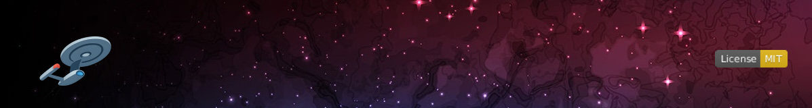

<!-- PROJECT BANNER -->

  

<h1 align="center">🌌 S'kaiNet — Exoplanet analyzer</h1>
<h6 align="center">by Outlander Team</h6>

  <em>"Boldly going where no algorithm has gone before."</em>

<h3 align="center">2025 NASA Space Apps Challenge</h3>

A World Away: Hunting for Exoplanets with AI

---

## 🚀 Overview

**S'kaiNet — Exoplanet analyzer** is an AI-powered exoplanet detection system developed for the **2025 NASA Space Apps Challenge**.
Inspired by *Star Trek’s* Vulcan pursuit of knowledge — **“S'kai”**, meaning enlightenment — our project combines scientific curiosity with artificial intelligence to identify exoplanets from NASA’s open datasets.

Our mission: To build an intelligent platform that helps humanity discover new worlds — automatically.

## 🧠 Machine Learning 
### [Documentation](../machine_learning/README.md)

---

## 🎥 Demo

## The Challenge

NASA’s exoplanet missions — **Kepler**, **K2**, and **TESS** — have collected massive datasets from their space surveys.
However, most exoplanet discoveries are still **identified manually** by scientists.

We aim to automate this process through a **machine learning model** trained on **NASA’s open-source datasets**.
The model predicts whether an observation corresponds to a **confirmed exoplanet**, **planetary candidate**, or **false positive** — based on parameters like:

- Orbital Period
- Transit Duration
- Planetary Radius
- Stellar Brightness

### 🌍 Our Approach

1. **Data Preprocessing:** Clean and normalize datasets from `Kepler` missions.
2. **Model Training:** Build and tune ML models using `scikit-learn`.
3. **Interactive UI:** Develop a web interface for real-time prediction and data uploads.
4. **Continuous Learning:** Allow users to retrain models dynamically with new data.

---

## 🧩 Technologies Used

### **Frontend**
| Technology | Purpose |
|-------------|----------|
| [Vite](https://vitejs.dev/) | Build tool for fast development |
| [React 18](https://react.dev/) | UI framework |
| [React Native](https://reactnative.dev/) | Mobile UI framework |
| [TypeScript](https://www.typescriptlang.org/) | Type safety |
| [TailwindCSS](https://tailwindcss.com/) | Styling framework |
| [HeroUI](https://www.heroui.com/) | Component library |
| [Framer Motion](https://www.framer.com/motion/) | Smooth animations |

### **Backend**
| Technology | Purpose |
|-------------|----------|
| [Python](https://www.python.org/) | Core backend language |
| [Flask](https://flask.palletsprojects.com/) | API and server framework |
| [scikit-learn](https://scikit-learn.org/) | Machine learning and analysis |

### **AI & LLMs**
| Technology | Purpose |
|-----------------------------|-------------------------------|
| GitHub Copilot | Code completion and suggestions |
| Claude Sonnet 3.7 / 4.0 | Advanced language modeling |
| GPT-4.1 / GPT-5.0-mini | Language modeling and reasoning |
| Google Gemini / NotebookLM | Storytelling and image generation |
| ChatGPT | Content creation and image generation |

> **Note:** For images and stories created by AI, see [image sources and credits](images/sources_and_credits.md) in the `images` directory.

---

## 🛰️ NASA Data & Resources

**Dataset:** [Kepler Objects of Interest (KOI)](https://exoplanetarchive.ipac.caltech.edu/cgi-bin/TblView/nph-tblView?app=ExoTbls&config=cumulative)

> This dataset lists all *confirmed exoplanets*, *planetary candidates*, and *false positives* observed by the Kepler mission.
> We use its labeled data for supervised learning, feature optimization, and classification testing.

---

## 🎯 Key Objectives

- ✅ Train an AI model on NASA’s exoplanet datasets
- ✅ Build a web interface for scientists and enthusiasts
- ✅ Support live visualization and accuracy tracking
- ✅ Enable users to upload and retrain data dynamically

---

## 👨‍🚀 Team Outlander

| Name | Role | GitHub |
|------|------|--------|
| **Jemshit Iskanderov** | Team Owner / Lead Developer | [@jemshit](https://github.com/jemshit) |
| **Nurmyrat Amanmadov** | Software Developer | [@amanmadov](https://github.com/amanmadov) |
| **Tarlan Abdullayev** | Software Developer | [@abdullayev-tarlan](https://github.com/abdullayev-tarlan) |
| **Parahat Iljanov** | Software Developer | [@parahatreis](https://github.com/parahatreis) |

---

## 🧭 Vision

We envision **S'kaiNet — Exoplanet analyzer** as a gateway for collaborative discovery — uniting data science, astronomy, and open-source innovation.
Our goal is to create a platform that **democratizes access to exoplanet exploration**, helping both researchers and enthusiasts contribute to space science.

---

## 🎬 The Exoplanet Enigma — Fictional Story Adaptation

Our team, **Outlander**, reimagined our NASA Space Apps Challenge project —
***A World Away: Hunting for Exoplanets with AI*** — as a cinematic *Star Trek*-inspired short screenplay titled ***The Exoplanet Enigma***.

In this fictional story, the crew of the **USS Enterprise-D**, led by **Captain Kirk**, **Spock**, and **Number One**, venture into a mysterious nebula and discover a gravitational anomaly resembling a planet. Unable to rely on visual assumptions, Spock deploys our AI-powered detection system **S’kaiNet - Exoplanet analyzer**, a scientific interface developed by **Starfleet’s Outlander Team**. Using real mission data from **Kepler**, the system calculates a 87 % probability that the object is a confirmed **exoplanet**.
Through this blend of **science fiction storytelling** and **real astrophysical methodology**, *The Exoplanet Enigma* mirrors the same logic and data-driven exploration principles behind our actual NASA project.

🎧 The story was also adapted into an **audio fiction podcast** titled ***S’kaiNet Chronicles***, combining cinematic voice acting, immersive sound design, and AI-generated narration to bring the Starfleet discovery to life.

---

### 🧠 Behind the Scenes

The screenplay and podcast were built directly upon our hackathon prototype.

* The fictional **S’kaiNet - Exoplanet analyzer** system mirrors the architecture of our real-world AI model, which analyzes exoplanetary transit data to detect potential new worlds.
* We used **OpenAI, Google Gemini, NotebookLM tools**, **Python**, and **machine-learning pipelines** integrated with NASA’s **exoplanet archives** to train and test the model.
* The **screenplay** was written in *Fountain* format and professionally styled to standard Hollywood formatting, while the **podcast** was produced from the same script using AI-assisted audio synthesis and human-directed editing.

This creative adaptation demonstrates how data science, storytelling, and imagination can converge to make complex scientific concepts both **accessible** and **inspiring**.

---

### 🎧 Listen Now

> Experience the *S’kaiNet Chronicles* — a fictional Starfleet log that bridges science and imagination.
> Follow the crew of the USS Enterprise-D as they use real NASA-inspired AI technology to uncover new worlds.

🎙️ **Episode 1:** [*The Exoplanet Enigma*](stories/skainet-chronicles.m4a)
- 📥 **[Download Audio](stories/skainet-chronicles.m4a)** *(Right-click → Save As)*
- 🎧 **[Listen Online](https://github.com/jemshit/NASA_exoplanet_detection/raw/main/docs/stories/skainet-chronicles.m4a)** *(Direct stream)*

🎬 **Video:** [*The Exoplanet Enigma - Visual Story*](https://youtu.be/R9a3tQScMtw)
- 🎥 **[Download Video](stories/skainet-chronicles.mp4)**

📚 **Comic Con Special Edition:** [the-exoplanet-enigma.pdf](stories/the-exoplanet-enigma.pdf)

📜 **Read the full screenplay:** [screenplay.pdf](stories/screenplay.pdf)

---

	<em>“Logic is the beginning of wisdom, not the end.”</em> 
	— <strong>Spock</strong>

	

